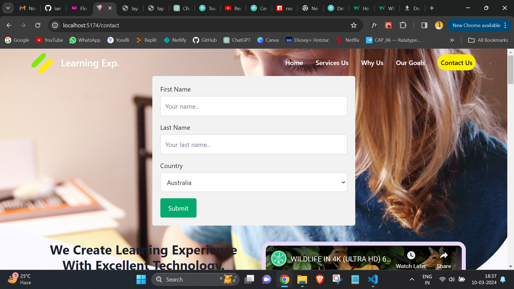
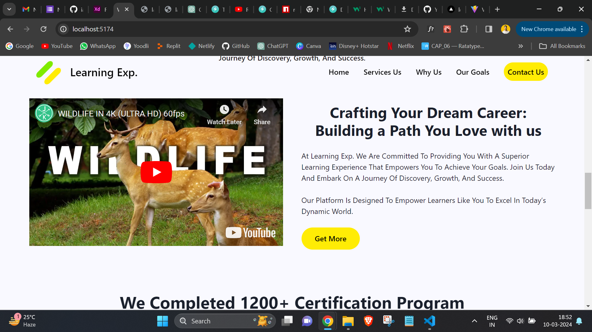
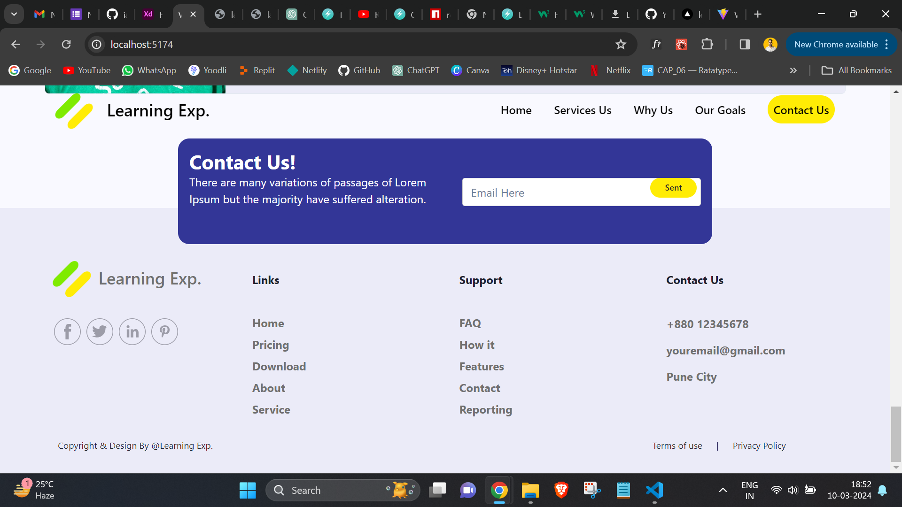

# Learning_Exp.Landing_Page Clone

This react project has been scaffolded by using Vite build tool wherein I am using following:-

## Tech Stack

    - React
    - CSS

## Library

    - Chakra UI
    - React-Router-Dom

## Navbar

In the navbar i added the navigate functionality to move to contact form

- to take form value i used `useReducer Hook`
- Once user click on submit it will show a login status to achieve that i used toast component from chakra ui

-I've also added the functionality of scroll down to change the color of nav link

## Landing Page

- On Main Landing i've added the video using a library name `react iframe` to achieve this.
  

## Footer

- on Footer Section i overlapped the contact page exact as it looked in the ui
  
